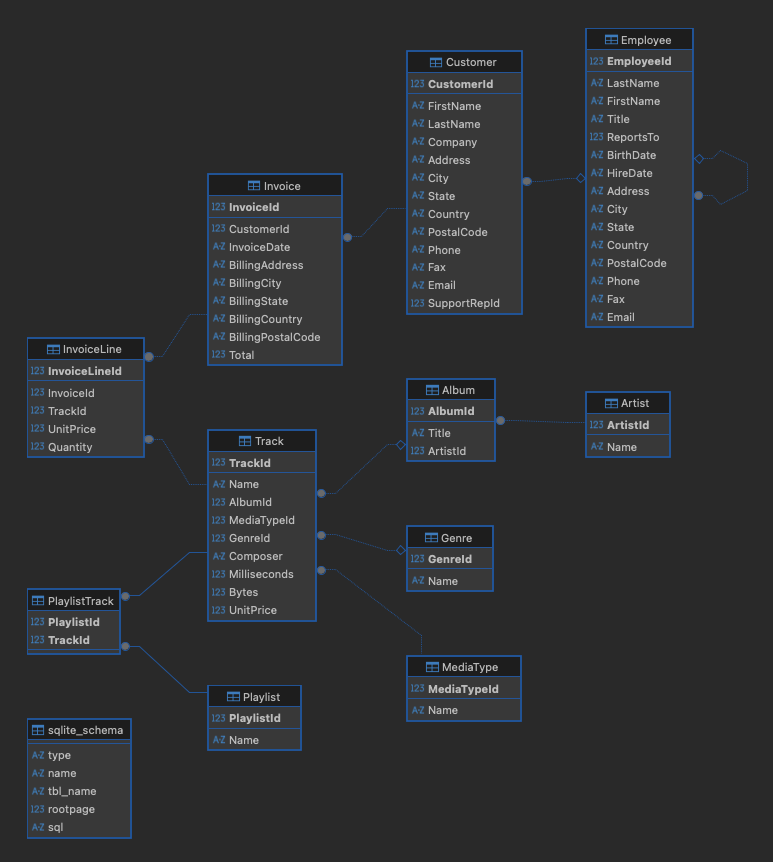

# Chinook SQL Business Analysis

## 1. Project Overview
SQL analysis of the Chinook database to identify revenue drivers, customer behaviour, and product performance.

### Project Objective
This project analyses sales and customer data from a digital music store (Chinook database) to understand:

- Which countries and customers generate the most revenue
- Which products (tracks, genres, artists) drive revenue
- What patterns exist in customer purchasing behaviour

The goal is to generate actionable business insights that could help increase revenue, as well as improve marketing focus and customer retention.

### 1.1. Dataset
The Chinook database simulates a digital music store and includes the following tables:

<p align="left">
  
</p>

Relationships between these tables allow for analysis across customers, regions, products, and transactions.

### 1.2. Tools Used
- SQL (SQLite)
- DBeaver

## 2. Key Analysis & Insights
The analysis below answers the primary business questions outlined in the project objective.

### 2.1. Revenue by Country
Which countries generate the highest total revenue?

#### SQL Query
  ```sql
  SELECT
      i.BillingCountry AS country,
      SUM(i.Total) AS total_revenue
  FROM Invoice AS i
  GROUP BY i.BillingCountry
  ORDER BY total_revenue DESC;
  ```
| country          | total_revenue |
|------------------|--------------|
| USA              | 523.06       |
| Canada           | 303.96       |
| France           | 195.10       |
| Brazil           | 190.10       |
| Germany          | 156.48       |

Revenue is highest in the USA, which generates significantly more than any other country. 

There is a noticeable drop after the top few countries, suggesting that most revenue comes from a small number of key markets. 

This indicates strong performance in those regions, but also shows that revenue is not widely spread across all countries.

---
### 2.2. Revenue by Customer
Which customers generate the highest total revenue?

#### SQL Query
  ```sql
SELECT 
	c.FirstName || ' ' || c.LastName AS customer_name,
	c.Country,
	SUM(i.Total) AS revenue_per_customer
FROM Invoice AS i 
LEFT JOIN Customer AS c
ON i.CustomerId = c.CustomerId
GROUP BY customer_name, c.Country
ORDER BY revenue_per_customer DESC;
  ```
| customer_name             | Country          | revenue_per_customer |
|---------------------------|------------------|-------------|
| Helena Holý               | Czech Republic   | 49.62       |
| Richard Cunningham        | USA              | 47.62       |
| Luis Rojas                | Chile            | 46.62       |
| ...                       | ...              | ...         |
| Stanisław Wójcik          | Poland           | 37.62       |
| Steve Murray              | United Kingdom   | 37.62       |
| Puja Srivastava           | India            | 36.64       |

High-value customers are distributed across multiple countries rather than being concentrated in a single market. Although the USA generates the highest overall revenue, top individual customers are found in other countries.

This suggests that customer value is not limited to the largest markets, and that high-spending individuals exist across a wide range of regions.

---
### 2.3. Customer Count and Average Revenue by Country
How big is the customer base in each country and what is the average revenue generated per customer in each country?

#### SQL Query
```sql
WITH customer_revenue AS 
	(
	SELECT
        c.CustomerId,
        c.Country,
        SUM(i.Total) AS customer_revenue
    FROM Customer c
    LEFT JOIN Invoice i
        ON c.CustomerId = i.CustomerId
    GROUP BY c.CustomerId, c.Country
    )
SELECT
    Country,
    COUNT(*) AS customer_count,
    ROUND(AVG(customer_revenue), 2) AS average_customer_revenue
FROM customer_revenue
GROUP BY Country
ORDER BY customer_count DESC;
```
| Country   | customer_count | avg_revenue |
|-------------------|---------------|-------------|
| USA               | 13            | 40.24       |
| Canada            | 8             | 37.99       |
| France            | 5             | 39.02       |
| Brazil            | 5             | 38.02       |
| Germany           | 4             | 39.12       |
| United Kingdom    | 3             | 37.62       |
| Portugal          | 2             | 38.62       |
| India             | 2             | 37.63       |
| Czech Republic    | 2             | 45.12       |
| Sweden            | 1             | 38.62       |
| ...               | ...           | ...         |
| Argentina         | 1             | 37.62       |

The USA has the largest customer base in the dataset, with a clear lead over other countries.

Average revenue per customer is relatively consistent across countries, with most values falling within a similar range. This suggests that differences in total revenue between countries are mainly driven by the number of customers rather than how much each individual spends.

As a result, countries with larger customer bases generate more overall revenue, while smaller markets contribute less despite having similar spending behaviour per customer.

---
### 2.4. Revenue by Genre
Which genre generates the highest total revenue?

```sql
SELECT
	g.name AS genre,
	SUM(il.UnitPrice * il.Quantity) AS total_revenue,
	SUM(il.Quantity) AS total_sales,
	AVG(il.UnitPrice) AS avg_price
FROM InvoiceLine AS il 
LEFT JOIN Track AS t
	ON il.TrackId = t.TrackId
LEFT JOIN Genre AS g 
	ON t.GenreId = g.GenreId
GROUP BY g.Name
ORDER BY total_revenue DESC;
```
| genre              | total_revenue | total_sales | avg_price |
|--------------------|--------------|-------------|-----------|
| Rock               | 826.65       | 835         | 0.99      |
| Latin              | 382.14       | 386         | 0.99      |
| Metal              | 261.36       | 264         | 0.99      |
| Alternative & Punk | 241.56       | 244         | 0.99      |
| TV Shows           | 93.53        | 47          | 1.99      |
| Jazz               | 79.20        | 80          | 0.99      |
| Blues              | 60.39        | 61          | 0.99      |
| Drama              | 57.71        | 29          | 1.99      |
| R&B/Soul           | 40.59        | 41          | 0.99      |
| Classical          | 40.59        | 41          | 0.99      |
| Sci Fi & Fantasy   | 39.80        | 20          | 1.99      |
| Reggae             | 29.70        | 30          | 0.99      |
| Pop                | 27.72        | 28          | 0.99      |
| Soundtrack         | 19.80        | 20          | 0.99      |
| Comedy             | 17.91        | 9           | 1.99      |
| Hip Hop/Rap        | 16.83        | 17          | 0.99      |
| Bossa Nova         | 14.85        | 15          | 0.99      |
| Alternative        | 13.86        | 14          | 0.99      |
| World              | 12.87        | 13          | 0.99      |
| Science Fiction    | 11.94        | 6           | 1.99      |
| Heavy Metal        | 11.88        | 12          | 0.99      |
| Electronica/Dance  | 11.88        | 12          | 0.99      |
| Easy Listening     | 9.90         | 10          | 0.99      |
| Rock And Roll      | 5.94         | 6           | 0.99      |

Rock is the dominant genre in both total revenue and sales volume, significantly outperforming all other genres.

Most genres have a consistent average price of 0.99, which suggests that differences in revenue are mainly driven by sales volume rather than pricing.

Genres with higher average prices (such as TV Shows and Drama) tend to have lower sales volumes, indicating that higher pricing may be associated with reduced demand. Overall, this suggests that volume of purchases plays a larger role in revenue generation than price differences across genres.

---
### 2.5. Revenue by Country and Genre
How do genre preferences vary across countries, and which genres generate the most revenue in each market?

#### SQL Query
```sql
SELECT
	g.Name AS genre_name,
	c.Country,
	SUM(IL.UnitPrice * il.Quantity ) AS total_revenue
FROM InvoiceLine AS il
LEFT JOIN Invoice AS i 
	ON il.InvoiceId = i.InvoiceId 
LEFT JOIN Customer AS c 
	ON i.CustomerId = c.CustomerId
LEFT JOIN Track AS t
	ON il.TrackId = t.TrackId
LEFT JOIN Genre AS g
	ON t.GenreId = g.GenreId
GROUP BY g.Name, c.Country 
ORDER BY total_revenue DESC;
```
| genre_name         | Country        | total_revenue |
|--------------------|---------------|--------------|
| Rock               | USA           | 155.43       |
| Rock               | Canada        | 105.93       |
| Latin              | USA           | 90.09        |
| Rock               | Brazil        | 80.19        |
| Rock               | France        | 64.35        |
| Metal              | USA           | 63.36        |
| Rock               | Germany       | 61.38        |
| Latin              | Canada        | 59.40        |
| Latin              | Brazil        | 52.47        |
| Alternative & Punk | USA           | 49.50        |
| ... 				 | ...           | ...          |

Rock is the top-performing genre across most countries, consistently generating the highest revenue in key markets such as the USA, Canada, and Brazil. This suggests that Rock has broad international appeal.

Other genres such as Latin and Metal also perform well in certain countries, indicating some regional variation in preferences. However, the overall pattern shows that the same few genres tend to dominate across different markets.

This suggests that while there are minor differences in genre popularity between countries, customer preferences are largely consistent globally, with a small number of genres driving most revenue.

---
### 2.6. Customer Purchasing Behaviour
Is customer value driven more by purchase frequency or by higher spend per order?

#### SQL Query
```sql
SELECT
    c.FirstName || ' ' || c.LastName AS customer_name,
    COUNT(i.InvoiceId) AS order_count,
    SUM(i.Total) AS total_spent,
    ROUND(AVG(i.Total), 2) AS avg_order_value
FROM Customer AS c
LEFT JOIN Invoice AS i
    ON c.CustomerId = i.CustomerId
GROUP BY c.CustomerId
ORDER BY total_spent DESC;
```
| customer_name         | order_count | total_spent | avg_order_value |
|----------------------|------------|-------------|-----------------|
| Helena Holý          | 7          | 49.62       | 7.09            |
| Richard Cunningham   | 7          | 47.62       | 6.80            |
| Luis Rojas           | 7          | 46.62       | 6.66            |
| Ladislav Kovács      | 7          | 45.62       | 6.52            |
| Hugh O'Reilly        | 7          | 45.62       | 6.52            |
| Frank Ralston        | 7          | 43.62       | 6.23            |
| Julia Barnett        | 7          | 43.62       | 6.23            |
| Fynn Zimmermann      | 7          | 43.62       | 6.23            |
| Astrid Gruber        | 7          | 42.62       | 6.09            |
| Victor Stevens       | 7          | 42.62       | 6.09            |
| ...                  | ...        | ...         | ...             |

Most customers have a similar number of orders, with the majority making seven purchases.

As a result, differences in total customer revenue are primarily driven by variations in average order value rather than purchase frequency. Customers who spend more per order generate higher overall revenue despite having the same number of transactions as others.

This suggests that, within a fixed customer base, increasing average order value may be more effective than increasing purchase frequency when looking to drive revenue.

## 3. Key Findings

- Revenue is heavily concentrated in a small number of countries, with the USA leading by a significant margin.
- Average customer spend is consistent across countries, meaning differences in country-level revenue are driven by the number of customers rather than individual spending.
- High-value customers are distributed globally, not just in the largest markets.
- Rock is the dominant genre across all markets, with strong and consistent performance internationally.
- Revenue across genres is driven more by sales volume than pricing, as most tracks have a standard price.
- At the individual level, differences in customer revenue are driven by average order value rather than purchase frequency.

## 4. Business Recommendations

- Focus on expanding the customer base in smaller markets, as this is the main driver of overall revenue and customer spending behaviour is consistent across regions.
- In high-performing markets such as the USA and Canada, implement strategies to increase average order value (e.g. bundles or recommendations), rather than focusing solely on increasing purchase frequency.
- Increase the number of tracks available in high-performing genres such as Rock and Latin to drive higher sales volume.

## 5. Limitations

- The dataset is relatively small and may not fully reflect real-world customer behaviour.
- Unit pricing is mainly fixed, limiting deeper analysis of price sensitivity.
- Customer behaviour is consistent across the dataset, which may have simplified some conclusions.

## 6. Next Steps

- Build visual dashboards (Tableau / Power BI) to present findings more interactively.
- Analyse customer retention and repeat purchase behaviour over time.
- Explore segmentation by customer demographics or purchase history.


